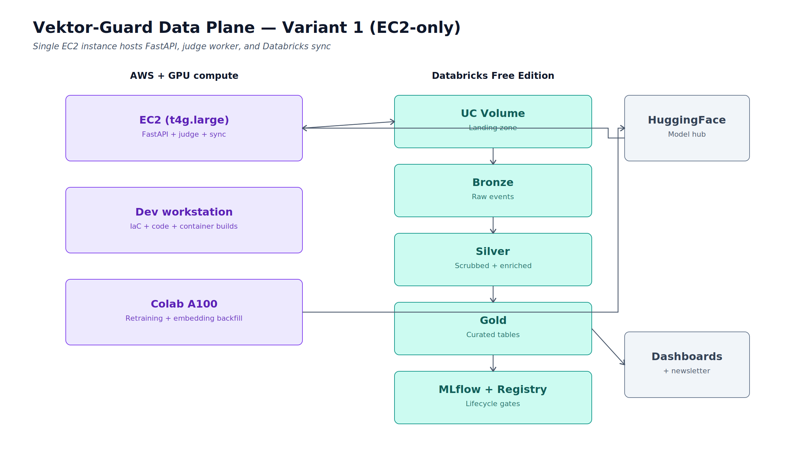
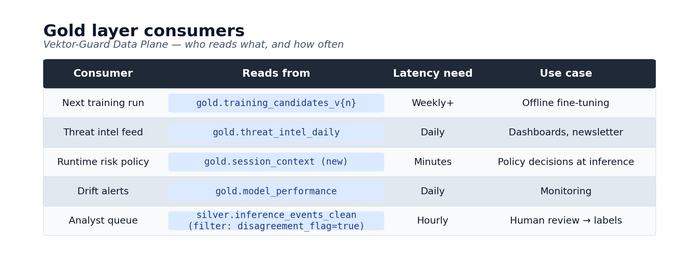

# Vektor-Guard Telemetry Lakehouse

[](https://www.terraform.io/)
[](https://aws.amazon.com/)
[](https://www.databricks.com/)
[](https://delta.io/)
[](https://www.python.org/)
[](https://fastapi.tiangolo.com/)
[](https://www.docker.com/)
[](LICENSE)
[](#build-status)

A closed-loop telemetry lakehouse for the [Vektor-Guard](https://huggingface.co/theinferenceloop/vektor-guard-v2) prompt-injection and jailbreak classifier. Every production inference becomes a candidate training example - versioned, governed, and traceable from raw event back to the model artifact it trains.

> **Why this exists.** AI security models decay. Attackers evolve, the training distribution goes stale, and a classifier that doesn't see production traffic can't learn from it. Most AI security products ship a model and never close the loop. This project is the telemetry lakehouse that closes it.

---

## Table of contents

- [Architecture](#architecture)
- [Project status](#project-status)
- [Tech stack](#tech-stack)
- [Repository structure](#repository-structure)
- [Quick start](#quick-start)
- [Documentation](#documentation)
- [Roadmap](#roadmap)
- [License](#license)
- [Author](#author)

---

## Architecture

Two-phase build. Phase 1 ships a working end-to-end pipeline on a single EC2 instance running five Docker Compose services. Phase 2 refactors the two compute-heavy workloads (judge worker and synthetic generator) to event-driven serverless, demonstrating the monolith to microservices transition as its own portfolio artifact.

<p align="center">
  
</p>

The lakehouse is fed by two complementary event sources: deterministic replay of a labeled corpus for validation, and live LLM-driven synthetic generation for variety and load. Both feed the same FastAPI endpoint with provenance tagging that flows through to the bronze layer.

The lakehouse serves two consumption paths:

<p align="center">
  
</p>

| Loop | Latency | Consumer | Purpose |
|---|---|---|---|
| **Slow** | Weekly+ | `gold.training_candidates_v{n}` | Offline fine-tuning, versioned datasets |
| **Fast** | Daily | `gold.threat_intel_daily` | Threat intel feed, dashboards, newsletter |
| **Fast** | Minutes | `gold.session_context` | Runtime risk policy decisions |
| **Fast** | Daily | `gold.model_performance` | Drift detection, registry promotion gates |
| **Fast** | Hourly | `silver.inference_events_clean` (filter: `disagreement_flag=true`) | Analyst review queue, high-quality labels |

Full architecture, design rationale, and decision log: **[docs/architecture.md](docs/architecture.md)**.

---

## Project status

**Phase 1 in progress.** AWS infrastructure complete; Databricks setup and runtime services next.

| Phase | Scope | Status |
|---|---|---|
| **Phase 1** | EC2 monolith runtime + medallion + MLflow lifecycle | 🚧 In progress |
| **Phase 2** | Refactor judge worker and synthetic generator to Lambda + SQS | ⏳ Planned |

### Build status - Phase 1

- ✅ Terraform foundation (providers, variables, tagging, account-ID guardrail)
- ✅ AWS infrastructure (IAM, VPC, S3, Secrets Manager, CloudWatch, EC2, EventBridge)
- 🚧 Databricks setup (catalog, schema, volume created; Terraform-managed schema and volume pending)
- [ ] Runtime services (FastAPI emit, sync agent, judge worker, replay agent, synthetic generator)
- [ ] CI/CD (GitHub Actions to ECR to SSM Run Command)
- [ ] Medallion (bronze ingestion, silver enrichment, gold curation)
- [ ] MLflow lifecycle and Model Registry promotion gates
- [ ] End-to-end smoke test

---

## Tech stack

### AWS infrastructure

- EC2 `t4g.large` (Graviton2, ARM64)
- IAM (least-privilege instance profile, account-ID guardrail)
- S3 (event archive, TLS-only, Glacier IR lifecycle)
- Secrets Manager
- SSM Parameter Store
- CloudWatch Logs (split per workload, 14-day retention)
- ECR
- EventBridge Scheduler (weekday 10-17, manual override outside hours)

### Infrastructure as code

- Terraform 1.9+
- AWS provider `~> 5.70`
- Databricks provider
- `tflint`
- `checkov`

### CI/CD

- GitHub Actions
- Self-hosted runner (Proxmox)
- AWS SSM Run Command
- `docker buildx` (ARM64 native, dev workstation to Graviton)

### Runtime - Vektor-Guard service

- Python 3.13
- FastAPI + Uvicorn (Gunicorn workers)
- Pydantic v2
- transformers + PyTorch CPU (ModernBERT-large)
- structlog
- prometheus-client
- databricks-sdk-py
- boto3
- Anthropic + OpenAI SDKs
- HuggingFace `datasets`
- Docker + Docker Compose
- Systemd

### Databricks lakehouse (Free Edition)

- Unity Catalog (tags, row filters, column masks, lineage, audit)
- Delta Lake
- Auto Loader
- Structured Streaming
- Lakeflow Declarative Pipelines
- MLflow + Model Registry
- Feature Store (offline)
- Databricks SQL

### External services

- HuggingFace Hub (model artifacts and replay corpus, SHA-pinned)
- Anthropic API (Claude judge and synthetic generator)
- OpenAI API (GPT judge and critic)
- Weights & Biases (training tracking)

### Observability

- CloudWatch (logs, metrics, alarms)
- MLflow UI
- Unity Catalog audit logs
- Databricks SQL dashboards

---

## Repository structure

```text
vektor-guard-telemetry-lakehouse/
├── README.md                       # this file
├── .gitignore
├── LICENSE
├── docs/
│   ├── architecture.md             # full design, rationale, decision log
│   └── img/                        # diagrams referenced from docs
├── terraform/                      # AWS + Databricks infrastructure
│   ├── versions.tf
│   ├── providers.tf
│   ├── variables.tf
│   ├── locals.tf
│   ├── iam.tf
│   ├── network.tf
│   ├── security_group.tf
│   ├── s3.tf
│   ├── secrets.tf
│   ├── logs.tf
│   ├── ec2.tf
│   ├── scheduler.tf
│   ├── outputs.tf
│   └── terraform.tfvars.example
├── docker/
│   ├── Dockerfile.runtime
│   └── docker-compose.yml
├── src/
│   └── vektor_guard_runtime/        # Python service code
│       ├── fastapi_app.py           # inference endpoint + event emitter
│       ├── sync_agent.py            # rolling file sink to UC volume sync
│       ├── judge_worker.py          # dual-LLM verdict generation
│       ├── replay_agent.py          # labeled corpus replay
│       └── synthetic_generator.py   # dual-LLM adversarial generation
└── tests/
    └── smoke/
        └── databricks_smoke_test.py # validates UC volume write path
```

---

## Quick start

> ⚠️ This project is in active development. The instructions below describe the target state. See [Project status](#project-status) for what currently works.

### Prerequisites

- **Local tooling:** Terraform 1.9+, AWS CLI v2, Docker (or OrbStack), Python 3.13, Databricks CLI, GitHub CLI
- **Cloud accounts:** AWS account with admin (for initial bootstrap), Databricks Free Edition workspace, HuggingFace account, Anthropic + OpenAI API keys

### Bootstrap

```bash
# 1. Clone and enter
git clone https://github.com/<owner>/vektor-guard-telemetry-lakehouse.git
cd vektor-guard-telemetry-lakehouse

# 2. Configure variables
cp terraform/terraform.tfvars.example terraform/terraform.tfvars
# edit terraform/terraform.tfvars with your account values

# 3. Plan and apply infrastructure
cd terraform
terraform init
terraform plan
terraform apply

# 4. Populate secrets (out-of-band, values never land in Terraform state)
aws secretsmanager put-secret-value --secret-id vektor-guard-dp-dev/databricks-pat --secret-string "<your-PAT>"
aws secretsmanager put-secret-value --secret-id vektor-guard-dp-dev/anthropic-api-key --secret-string "<your-key>"
aws secretsmanager put-secret-value --secret-id vektor-guard-dp-dev/openai-api-key --secret-string "<your-key>"

# 5. Update Databricks workspace URL parameter (set after workspace creation)
aws ssm put-parameter --name /vektor-guard-dp-dev/databricks/workspace-url \
  --value "https://dbc-xxxxxxxx-yyyy.cloud.databricks.com" --type String --overwrite

# 6. Verify the Databricks write path
python tests/smoke/databricks_smoke_test.py

# 7. Build and push runtime image (Phase D, CI/CD handles ECR push and SSM deploy)
cd ../docker
docker buildx build --platform linux/arm64 -t vektor-guard-runtime:latest -f Dockerfile.runtime ..
```

### Cost note

EventBridge schedules start the EC2 instance at 10:00 and stop it at 17:00 local time, weekdays only. Manual start/stop covers off-hours work. At `t4g.large` on-demand pricing this keeps compute under ~$12/month. S3 plus Secrets Manager plus CloudWatch adds another few dollars. Databricks Free Edition is $0. LLM API spend for the synthetic generator adds ~$20-50/month depending on usage; the generator is on-demand only, model-tier-aware (cheap for bulk generation, expensive for critique), and tracks per-batch cost.

Total monthly project cost target: **under $80**, typically closer to $40 during normal development.

---

## Documentation

| Document | Purpose |
|---|---|
| **[docs/architecture.md](docs/architecture.md)** | Full architecture, design rationale, decision log |
| **[docs/img/](docs/img/)** | Architecture diagrams (PNG) |

---

## Roadmap

### Phase 1 - EC2 monolith ⬅ *current*
End-to-end pipeline on a single EC2 instance. Five Docker Compose services: FastAPI inference endpoint, judge worker, sync agent, replay agent, synthetic generator. Medallion lakehouse. MLflow lifecycle. Three gold tables: `training_candidates_v{n}`, `model_performance`, `synthetic_corpus_v{n}`.

### Phase 2 - Event-driven refactor
Refactor the two compute-heavy services (judge worker and synthetic generator) to AWS Lambda triggered via SQS. EC2 slims to FastAPI, sync agent, and replay agent only. Adds gold tables: `threat_intel_daily`, `session_context`. Two demonstrations of the monolith-to-microservices pattern, not one.

### Future

- Multi-tenant simulation (synthetic tenants for governance demonstration)
- TrustTrace integration (commercial deployment, separate stack)
- Real-time feature serving for sub-100ms risk scoring
- Vektor-Guard deployed in front of real LLM endpoints (live event source)

---

## License

MIT, see [LICENSE](LICENSE).

---

## Author

**Matt Sikes** · Principal Architect · [The Inference Loop](https://theinferenceloop.substack.com)

Building open-source AI security tools and writing about AI infrastructure at [theinferenceloop.substack.com](https://theinferenceloop.substack.com). Related work:

- **[Vektor-Guard](https://huggingface.co/theinferenceloop/vektor-guard-v2)** - the model this lakehouse serves
- **[The Inference Loop](https://theinferenceloop.substack.com)** - newsletter and open-source lab
