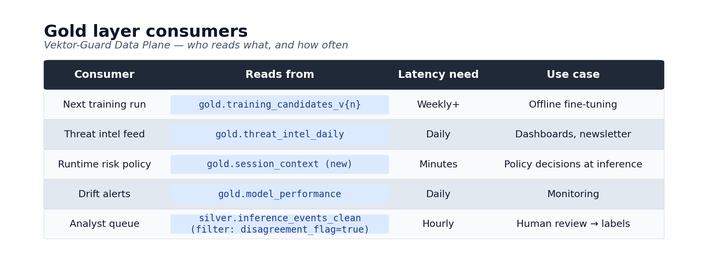
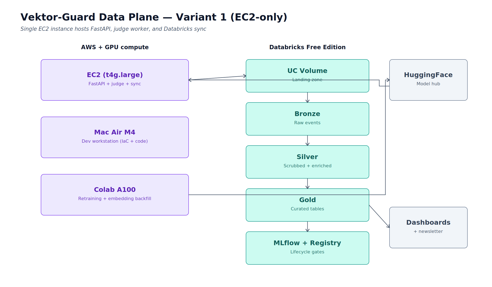

# Vektor-Guard Data Plane

**Project:** Closed-loop telemetry and training-data pipeline for the Vektor-Guard prompt injection / jailbreak classifier
**Repo:** `vektor-guard-data-plane`
**Status:** Phase 1 build (in progress)
**Last updated:** April 2026

---

## Contents

1. [Problem statement](#problem-statement)
2. [Solution overview](#solution-overview)
3. [Consumption paths](#consumption-paths)
4. [Event sources](#event-sources)
5. [Architecture diagrams](#architecture-diagrams)
6. [Repository structure](#repository-structure)
7. [Bronze schema notes](#bronze-schema-notes)
8. [Cost envelope](#cost-envelope)
9. [Phase 1 tech stack - Variant 1 (EC2-only)](#phase-1-tech-stack---variant-1-ec2-only)
10. [Phase 2 tech stack - Variant 2 (event-driven judge split)](#phase-2-tech-stack---variant-2-event-driven-judge-split)

---

## Problem statement

Vektor-Guard (`theinferenceloop/vektor-guard-v1`) is a fine-tuned prompt injection and jailbreak classifier. Like other AI security models, it has a built-in weakness: attackers evolve and the training distribution goes stale.

Phase 2 of the model hit **99.8% F1** on its test set, but that F1 is against *known* patterns. A model that doesn't see production traffic can't learn from production traffic, and will therefore decay. This is a common failure mode for production ML - data goes stale, the model doesn't.

## Solution overview

A data plane that turns Vektor-Guard's inference events into versioned training sets and operational telemetry - closing the loop from "model in production" back to "next model's training data," with **reproducibility, governance, and auditability** as first-class properties.

The pipeline is built before the model has live production traffic. Initial events come from two complementary synthetic sources (replay and generation) that exercise the full pipeline against known-truth data. Live traffic layers in later when Vektor-Guard is deployed in a product context.

## Consumption paths

The data plane serves two distinct consumption paths with very different latency profiles.

### Path 1 - Offline: retraining the model (weeks to months)

Gold-layer `training_candidates_v{n}` tables feed the next fine-tuning run. This happens quarterly, or whenever enough hard negatives and novel patterns have been accumulated.

The data plane produces **auditable, versioned, and reproducible** datasets. The model is retrained on the updated data, evaluated against held-out data, and promoted through the Model Registry.

### Path 2 - Online: informing runtime security decisions (real-time to daily)

Gold-layer aggregates inform decisions the **currently deployed** model makes - without retraining it. Four sub-paths:

1. **Threat intelligence feed** - daily rollups of attack patterns (novel clusters, surging attack classes, pattern frequency per hour) form a JSON feed that security teams consume.

2. **Runtime risk adjustment** - Vektor-Guard outputs a class and a confidence score. Gold-layer context can modify the downstream action without changing the model. Example: *"this session has already triggered 3 low-confidence flags in the last 10 minutes - escalate the next borderline prediction to block instead of log-only."* The model didn't change; the policy layer reading the gold data did.

3. **Canary / drift detection** - if today's predicted-class distribution diverges significantly from the 30-day trailing baseline, a drift alert fires. Could mean a new attack campaign, could mean the model is degrading. Either way, it's actionable before retraining is possible.

4. **Analyst review queue** - high-confidence-but-disagreement cases (Vektor-Guard says benign, LLM judge says injection) surface to a review dashboard. Analyst labels feed back into Path 1 as the highest-quality training examples.

## Event sources

The pipeline is fed by two complementary event sources, both POSTing to the same FastAPI endpoint with provenance tagging that flows through to the bronze layer.

### Source 1 - Replay agent

Deterministic replay of a labeled corpus. Source: the Phase 3 synthetic dataset on HuggingFace (`theinferenceloop/vektor-guard-phase3`, 1,514 examples across 5 attack classes).

**Purpose:** end-to-end pipeline validation. Every replayed event has a known ground-truth label, so gold-layer outputs (model performance, classification distributions) can be validated against an oracle. Catches regressions in the data plane itself, not just the model.

**Configuration:** rate, jitter, shuffle, optional class filter. Single-threaded by default for predictability. Tagged with `event_source = "replay"` and provenance metadata pointing to dataset ID, revision SHA, and row index.

### Source 2 - Synthetic generator

Live LLM-driven generation of new prompt injection and jailbreak examples, parameterized by attack class, severity, language, length, and adversarial sophistication.

**Pattern:** dual-LLM with critic feedback loop, extending the Phase 3 generation pipeline.

1. Generator LLM produces a candidate attack matching the requested parameters
2. Critic LLM scores it for realism, validates the assigned class, rates severity 1-5
3. If the critic significantly disagrees with target parameters, regenerate
4. On agreement, emit to FastAPI with `event_source = "synthetic"` and full provenance metadata
5. Persist to a Delta table (`gold.synthetic_corpus_v{n}`) with manifest hashing matching the `training_candidates` pattern

**Cost controls:** on-demand triggering (not continuous), cheap models for bulk generation, expensive models only for critique, per-batch cost tracking in metadata. Realistic budget ~$20-50/month with judicious use.

**Dual purpose:** the generator that loads the data plane is the same generator that produces training-data augmentation for Vektor-Guard v2. One factory, two consumers.

### Future event sources

Planned additions, not in Phase 1 scope:

- **Live production traffic** when Vektor-Guard is deployed in a product context (Inbox Zero Hero, Vela MCP, etc.) - tagged `event_source = "live"`
- **Red-team campaigns** for periodic adversarial pressure - tagged `event_source = "red-team"`
- **Smoke tests** for infrastructure validation, excluded from analytics - tagged `event_source = "smoke-test"`

## Architecture diagrams

### Gold layer consumption



### Phase 1 application architecture



## Repository structure

```text
vektor-guard-data-plane/
├── README.md
├── .gitignore
├── terraform/
│   ├── versions.tf
│   ├── providers.tf
│   ├── variables.tf
│   ├── locals.tf
│   ├── iam.tf
│   ├── network.tf
│   ├── security_group.tf
│   ├── s3.tf
│   ├── secrets.tf
│   ├── logs.tf
│   ├── ec2.tf
│   ├── scheduler.tf
│   ├── outputs.tf
│   └── terraform.tfvars.example
├── docker/
│   ├── Dockerfile.runtime
│   └── docker-compose.yml
├── src/
│   └── vektor_guard_runtime/
│       ├── fastapi_app.py
│       ├── sync_agent.py
│       ├── judge_worker.py
│       ├── replay_agent.py
│       └── synthetic_generator.py
└── docs/
    └── architecture.md
```

## Bronze schema notes

The bronze layer schema includes provenance columns to support multi-source ingestion from day one:

- **`event_source`** (STRING, enum) - one of `replay | synthetic | live | red-team | smoke-test`. Enables filtering of synthetic vs. production-like data in downstream gold-layer calculations.

- **`provenance`** (JSON) - source-specific metadata for full traceability:
  - `replay`: `{ "dataset_id": "...", "revision_sha": "...", "row_index": N }`
  - `synthetic`: `{ "generator_version": "...", "target_class": "...", "target_severity": N, "generator_model": "...", "critic_model": "...", "agreement_score": 0.0-1.0, "batch_id": "..." }`
  - `live`: `{ "deployment": "...", "user_session_hash": "..." }`

- **Standard columns** continue as previously designed: `event_id`, `event_ts`, `model_version`, `model_sha`, `predicted_class`, `predicted_confidence`, `latency_ms`, `tokens_in`, `tokens_out`, `tenant_id` (always `vg-research` in Phase 1), etc.

## Cost envelope

**Phase 1 monthly target: under $80/month total.**

| Component | Estimated monthly cost |
|---|---|
| EC2 `t4g.large` with EventBridge schedule (07:00-00:00) | ~$17 |
| S3 event archive + lifecycle | ~$2-5 |
| Secrets Manager (3 secrets) | ~$1.20 |
| CloudWatch Logs + Metrics | ~$2-5 |
| Synthetic generator LLM API spend (on-demand) | ~$20-50 |
| Databricks Free Edition | $0 |
| **Total** | **~$45-80** |

The synthetic generator is the largest variable cost. Mitigations are architectural: on-demand triggering only, cheap models for bulk generation, expensive models only for critique, per-batch cost tracking.

---

## Phase 1 tech stack - Variant 1 (EC2-only)

End-to-end pipeline on a single EC2 instance running FastAPI, judge worker, sync agent, replay agent, and synthetic generator.

### AWS infrastructure

- **EC2** - `t4g.large` (Graviton2, ARM64, 2 vCPU, 8 GB RAM), Amazon Linux 2023
- **IAM** - instance role + instance profile, least-privilege policies for S3, Secrets Manager, CloudWatch, SSM
- **Networking** - default VPC, single public subnet, security group allowing SSM Session Manager only (no SSH ingress)
- **S3** - event archive bucket, SSE-S3 encryption, lifecycle rule to Glacier Instant Retrieval after 90 days
- **Secrets Manager** - Databricks PAT, Anthropic API key, OpenAI API key (shared across judge worker and synthetic generator)
- **Systems Manager Parameter Store** - non-sensitive runtime config (paths, batch sizes, rotation intervals, generator parameters)
- **CloudWatch** - log group + custom metrics + alarms (sync lag, error rate, generator cost-per-batch)
- **ECR** - private repository for the runtime container image
- **EventBridge Scheduler** - start 07:00 / stop 00:00 schedules with dedicated scheduler role

### Infrastructure as code

- **Terraform** 1.9+
- **AWS provider** `~> 5.70`
- **Databricks provider** - for UC volume, schema, grants, service principal
- **State** - local for now, S3 + DynamoDB remote state as a polish step
- **Linting** - `tflint` and `checkov` for security scanning

### CI/CD

- **GitHub Actions** as orchestrator
- **Self-hosted runner** on Proxmox VM 500 (already operational)
- **AWS SSM Run Command** for deploy-to-EC2 (no SSH keys in CI secrets)
- **Container builds** - `docker buildx` for ARM64 native (M4 → Graviton, no emulation)

### Runtime - Vektor-Guard service

Five Docker Compose services on the same EC2 instance:

- **FastAPI inference endpoint** + **Uvicorn** (Gunicorn workers) - serves Vektor-Guard, accepts POSTs from replay agent and synthetic generator, writes events to rolling JSON sink
- **Judge worker** - reads pending events, calls Claude + GPT for dual-LLM verdicts, writes verdicts to UC volume
- **Sync agent** - watches drop directory, pushes JSON files to UC volume via Databricks SDK
- **Replay agent** - loads Phase 3 corpus from HuggingFace, replays at configurable rate to FastAPI endpoint with provenance tagging
- **Synthetic generator** - dual-LLM (generator + critic) with controllable taxonomy, on-demand batch execution, cost tracking, persists to Delta

Common dependencies:

- **Python** 3.13.13
- **Pydantic v2** - request/response schemas
- **transformers** + **PyTorch CPU** - ModernBERT-large inference
- **structlog** - JSON-formatted logs to stdout for CloudWatch capture
- **prometheus-client** - `/metrics` endpoints, optional CloudWatch Agent scrape
- **databricks-sdk-py** - UC volume sync
- **boto3** - Secrets Manager, S3
- **anthropic** + **openai** SDKs - judge worker and synthetic generator
- **datasets** - HuggingFace corpus loading for replay agent
- **Docker** + **Docker Compose** - five services
- **Systemd** - service supervision, auto-restart

### Databricks data plane (Free Edition)

- **Unity Catalog** - single metastore, governance: tags, row filters, column masks, lineage, audit logs
- **Delta Lake** - storage format, ACID, schema evolution, time travel
- **Auto Loader** - incremental ingestion from UC volume
- **Structured Streaming** - bronze → silver transforms
- **Lakeflow Declarative Pipelines** *or* **Databricks Jobs** - medallion orchestration (pick one during build)
- **MLflow** - experiment tracking, manifest hash as run param
- **Model Registry** - stage transitions: None → Staging → Production → Archived
- **Offline Feature Store** - Delta tables for batch features
- **Databricks SQL warehouse** - 2X-Small, on-demand
- **SQL dashboards** on Gold

### Off-platform compute

- **Dev workstation** - IaC, Python source, container builds (ARM64 native)
- **Windows + RTX 4070 Super** - GPU embedding generation, model training
- **Google Colab Pro A100** - heavy retraining, full backfills

### External services

- **HuggingFace Hub** - model artifact registry (version-pinned by SHA at runtime pull); also source of replay corpus
- **Anthropic API** - Claude judge for dual-LLM verdicts; also generator/critic for synthetic data
- **OpenAI API** - GPT judge for dual-LLM verdicts; also generator/critic for synthetic data
- **Weights & Biases** - training run tracking, routes to `emsikes-theinferenceloop/vektor-guard`

### Observability

- **CloudWatch Logs + Metrics** - AWS-side
- **MLflow UI** - experiment review
- **Unity Catalog audit logs** - data access
- **Databricks SQL dashboards** - operational metrics, threat intel feeds

### Gold tables built in Phase 1

- `gold.training_candidates_v{n}` - offline retraining loop
- `gold.model_performance` - drift detection, registry promotion gates
- `gold.synthetic_corpus_v{n}` - persisted synthetic generation output, doubles as v2 training augmentation source

---

## Phase 2 tech stack - Variant 2 (event-driven refactor)

Phase 2 **adds to** Phase 1 - it doesn't replace anything except the location of compute-heavy workloads. The data plane and governance layer don't change.

### Architectural changes

Two compute-heavy services move off the EC2 monolith and into event-driven serverless:

1. **Judge worker** → Lambda + SQS
2. **Synthetic generator** → Lambda + SQS (or Step Functions for multi-stage critic loops)

EC2 slims to FastAPI + sync agent + replay agent only. Possible downsize: `t4g.large` → `t4g.medium` if memory allows.

### New AWS components

- **Lambda functions** - Python 3.13, ARM64 runtime, Graviton; one for judge, one for generator
- **SQS standard queues** - judge work intake, generator work intake
- **SQS dead-letter queues** - failed judgments and failed generations, alarmed
- **EventBridge rules** - scheduled backfill triggers, batch generation triggers
- **Step Functions** (optional) - multi-stage critic loops for the synthetic generator if simple Lambda chaining proves insufficient
- **IAM additions** - Lambda execution roles with SQS consume + Secrets Manager read + S3 write

### New Lambda dependencies

- **AWS Lambda Powertools** - structured logging, tracing, metrics
- **anthropic** SDK
- **openai** SDK
- **boto3** - already present, reused

### New gold-layer tables

- `gold.threat_intel_daily` - per-class rollups, novel pattern detection
- `gold.session_context` - session-level aggregates for runtime risk policy

### New Databricks features used

- **Streaming aggregations with watermarking** - for `session_context`
- **Lakeflow Pipelines** - if not already adopted in Phase 1
- **Additional MLflow experiment tags** - model version vs. judge agreement

### New observability

- **Lambda CloudWatch metrics** - invocations, errors, duration, throttles (per function)
- **SQS depth** + age-of-oldest-message alarms (per queue)
- **Cost dashboard** - Lambda + SQS + LLM API spend tracking

### Resume / interview vocabulary unlocked by Phase 2

- Event-driven serverless architecture
- Decoupled compute scaling
- Hybrid container + serverless
- Async work queue patterns
- Refactored monolith → microservices (two demonstrations of the pattern)
- Step Functions orchestration of multi-stage LLM workflows (if adopted)
